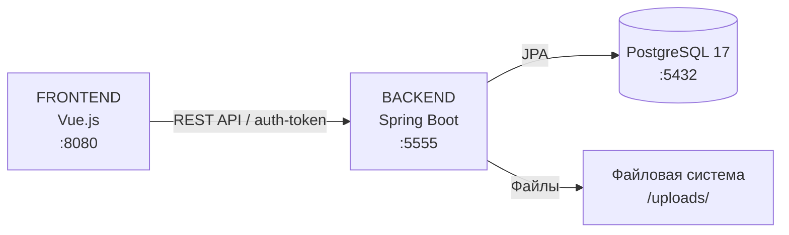

# Описание реализации дипломного проекта «Облачное хранилище»
### 1. Изучение протокола взаимодействия FRONT и BACKEND
Была изучена спецификация REST API в формате OpenAPI (yaml-файл), определяющая все необходимые методы: авторизация (/login), выход (/logout), загрузка, скачивание, удаление, переименование файла (/file) и получение списка файлов (/list). Установлено, что FRONT передаёт токен авторизации в HTTP-заголовке auth-token, а ответ сервера при успешной аутентификации должен содержать JSON-объект с полем auth-token. Все остальные запросы (кроме /login) требуют наличия этого заголовка. Для корректной работы кросс-доменных запросов необходима настройка CORS на стороне сервера.

### 2. Схема приложений


### 3. Архитектура приложения
Приложение построено по многослойной архитектуре:

Контроллеры (controller) — принимают HTTP-запросы, проверяют токен, делегируют бизнес-логику сервисам.

Сервисы (service) — реализуют бизнес-логику: аутентификация, работа с файлами.

Репозитории (repository) — обеспечивают доступ к данным через Spring Data JPA.

Модели (model) — JPA-сущности, отображаемые на таблицы базы данных.

DTO (dto) — объекты для передачи данных между клиентом и сервером.

Конфигурация (config) — настройка CORS-фильтра и инициализация тестового пользователя.

Хранение настроек:
Основные настройки приложения вынесены в файл application.yml, откуда они считываются Spring Boot. При запуске в Docker-контейнере параметры подключения к базе данных переопределяются через переменные окружения, заданные в docker-compose.yml.

Хранение больших файлов:
Загруженные файлы сохраняются в файловой системе сервера в каталог /uploads/{login}/. Путь к корневому каталогу задаётся свойством app.upload-dir в application.yml. Метаданные файлов (имя, размер, дата загрузки) хранятся в таблице files базы данных.

Структура базы данных (PostgreSQL):

Таблица users

Поле	Тип данных	Описание
id	BIGSERIAL	Первичный ключ
login	VARCHAR(255)	Уникальный логин пользователя
password	VARCHAR(255)	Пароль
auth_token	VARCHAR(255)	Токен авторизации
Таблица files

Поле	Тип данных	Описание
id	BIGSERIAL	Первичный ключ
filename	VARCHAR(255)	Имя файла
original_filename	VARCHAR(255)	Оригинальное имя при загрузке
size	BIGINT	Размер в байтах
file_path	VARCHAR(255)	Абсолютный путь к файлу на диске
content_type	VARCHAR(255)	MIME-тип
hash	VARCHAR(255)	Хеш (опционально)
user_id	BIGINT	Внешний ключ к таблице users
upload_date	TIMESTAMP	Дата и время загрузки
### 4. Создание репозитория проекта на GitHub
Репозиторий создан по адресу: https://github.com/MinorityKilla/cloud-storage. В него добавлен весь исходный код, Docker-файлы, README.md и файлы конфигурации.

### 5. Разработка приложения на Spring Boot
Приложение создано на базе Spring Boot 3.1.5 с использованием следующих зависимостей:

spring-boot-starter-web — для REST-контроллеров;

spring-boot-starter-data-jpa — для работы с PostgreSQL;

postgresql — драйвер базы данных;

lombok — для сокращения шаблонного кода;

testcontainers — для интеграционных тестов.

Сборка проекта осуществляется с помощью Maven.

Реализованы все методы согласно спецификации:

POST /login — авторизация и выдача токена;

POST /logout — деактивация токена;

GET /list?limit=N — список файлов с ограничением количества;

POST /file?filename=... — загрузка файла (multipart/form-data);

DELETE /file?filename=... — удаление файла;

GET /file?filename=... — скачивание файла;

PUT /file?filename=... — переименование файла.

Обработка ошибок возвращает JSON в формате {"message": "...", "id": ...} с соответствующими HTTP-статусами.

### 6. Тестирование с помощью curl/Postman
После запуска приложения в Docker-контейнерах было проведено ручное тестирование всех эндпоинтов с помощью утилиты curl. Проверены сценарии:

успешная авторизация с получением токена;

доступ к защищённым ресурсам с валидным токеном;

отказ в доступе при невалидном токене (401);

загрузка, скачивание, удаление и переименование файлов;

получение списка файлов с параметром limit.

Все запросы отработали в соответствии со спецификацией.

Также были написаны модульные тесты (20 тестов) с использованием Mockito и интеграционные тесты с использованием Testcontainers (PostgreSQL), подтверждающие работоспособность сервисов и контроллеров.

### 7. Тестирование с FRONT
Внешний интерфейс на Vue.js был запущен локально (порт 8080) и подключён к разработанному backend (порт 5555) после настройки переменной VUE_APP_BASE_URL=http://localhost:5555 в файле .env FRONT-приложения. Была проверена полная цепочка: авторизация в браузере, отображение списка файлов, загрузка и удаление файлов через веб-интерфейс. FRONT успешно взаимодействует с BACKEND, все запросы проходят авторизацию по токену.

### 8. Написание README.md
В корне проекта размещён файл README.md, содержащий:

описание проекта и используемых технологий;

таблицу API-эндпоинтов;

инструкцию по запуску через Docker;

тестовые учётные данные;

команды для запуска unit-тестов.

### 9. Отправка на проверку
Код загружен в GitHub-репозиторий, готов к проверке. Все требования дипломного задания выполнены.


# Облачное хранилище (Cloud Storage)

Дипломный проект — REST-сервис для облачного хранения файлов.

## Стек технологий

- **Backend:** Java 17, Spring Boot 3.1.5, Spring Data JPA
- **База данных:** PostgreSQL 17
- **Сборщик:** Maven
- **Контейнеризация:** Docker, Docker Compose
- **Тестирование:** JUnit 5, Mockito, Testcontainers

## Требования для запуска

- Установленный Docker Desktop
- Java 17 (только для сборки, можно не устанавливать, если собирать внутри Docker)
- Maven (или использовать Maven wrapper `./mvnw`)

## Быстрый старт (локально)

```bash
# 1. Клонировать репозиторий
git clone https://github.com/MinorityKilla/cloud-storage.git
cd cloud-storage

# 2. Собрать jar-файл
mvn clean package -DskipTests

# 3. Запустить сервисы (PostgreSQL + приложение)
docker-compose up -d

# 4. Проверить работу
curl -X POST http://localhost:5555/login \
  -H "Content-Type: application/json" \
  -d '{"login":"user","password":"password"}'
```

Приложение будет доступно на **http://localhost:5555**

## Тестовый пользователь

- **Логин:** `user`
- **Пароль:** `password`

## API Endpoints

| Метод | URL | Описание | Заголовки |
|-------|-----|----------|-----------|
| POST | `/login` | Авторизация | Content-Type: application/json |
| POST | `/logout` | Выход | auth-token: {токен} |
| GET | `/list?limit=N` | Список файлов | auth-token: {токен} |
| POST | `/file?filename=name` | Загрузка файла | auth-token: {токен}, multipart/form-data |
| GET | `/file?filename=name` | Скачать файл | auth-token: {токен} |
| DELETE | `/file?filename=name` | Удалить файл | auth-token: {токен} |
| PUT | `/file?filename=name` | Переименовать файл | auth-token: {токен}, Content-Type: application/json |

### Примеры запросов

```bash
# Получить токен
TOKEN=$(curl -s -X POST http://localhost:5555/login \
  -H "Content-Type: application/json" \
  -d '{"login":"user","password":"password"}' | grep -o '"auth-token":"[^"]*"' | cut -d'"' -f4)

# Загрузить файл
echo "Hello" > test.txt
curl -X POST "http://localhost:5555/file?filename=test.txt" \
  -H "auth-token: $TOKEN" \
  -F "file=@test.txt"

# Список файлов
curl -X GET "http://localhost:5555/list?limit=10" \
  -H "auth-token: $TOKEN"

# Переименовать
curl -X PUT "http://localhost:5555/file?filename=test.txt" \
  -H "auth-token: $TOKEN" \
  -H "Content-Type: application/json" \
  -d '{"name":"new.txt"}'

# Скачать
curl -X GET "http://localhost:5555/file?filename=new.txt" \
  -H "auth-token: $TOKEN" \
  -o downloaded.txt

# Удалить
curl -X DELETE "http://localhost:5555/file?filename=new.txt" \
  -H "auth-token: $TOKEN"
```

## Запуск тестов

```bash
# Только unit-тесты (Mockito)
mvn test -Dtest="!CloudStorageIntegrationTest"

# Интеграционные тесты (требуется Docker)
mvn test
```

## Остановка

```bash
docker-compose down
```

## Схема приложений



## Структура базы данных

### users
| Поле | Тип | Описание |
|------|-----|----------|
| id | BIGSERIAL | Первичный ключ |
| login | VARCHAR | Уникальный логин |
| password | VARCHAR | Пароль |
| auth_token | VARCHAR | Токен |

### files
| Поле | Тип | Описание |
|------|-----|----------|
| id | BIGSERIAL | Первичный ключ |
| filename | VARCHAR | Имя файла |
| size | BIGINT | Размер в байтах |
| file_path | VARCHAR | Путь к файлу |
| user_id | BIGINT | Владелец |
| upload_date | TIMESTAMP | Дата загрузки |

## Автор

Minoritykilla – дипломный проект «Облачное хранилище»
